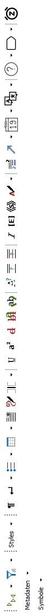

---
title: "Buttons Oxygen XML"
author: 
    - Lena Hofmann
    - Till Grallert
date: 2018-01-11
---

# Buttons Oxygen XML Editor und auszuzeichnende Elemente
## Aktuelle Knöpfe im Ediarum-Interface

|                   deutsch                    |        english         |  Anmerkung   |    tag / attribute combinations    |
|----------------------------------------------|------------------------|--------------|------------------------------------|
| Neuer Absatz                                 | new paragraph          |              | p                                  |
| Zeilenumbruch                                | line break[^1]         |              | lb                                 |
| Listen                                       | lists                  |              | list                               |
| Tabelle                                      | table / chart          |              | table                              |
| Anmerkung d. Autors                          | Author's note          |              | note (plus attribute?)             |
| Zeichnung                                    | drawing / subscription |              | graphic                            |
| *Folio- u. Seitenwechsel*                    | page break[^1]         | *streichen?* | pb                                 |
| Unterstrichen                                | underline              |              | hi    ?                            |
| Hochstellen                                  | superscript            |              |                                    |
| Streichung                                   | deletion               |              | del                                |
| Korrektur durch Autor                        | author's correction    |              | choice/corr ?                      |
| Unsichere Lesart                             | uncertain reading      |              |                                    |
| nicht entzifferbar, Schäden und Auslassungen | undecipherable         |              |                                    |
| nicht entzifferbar, durchgestrichen          | undecipherable         |              |                                    |
| Ergänzung                                    | supplement             |              | add                                |
| Fehlendes Wort                               | missing word           |              | gap                                |
| Streichung d. Bearbeiter                     | editor's deletion      |              |                                    |
| Korrekturen                                  | corrections            |              |                                    |
| Sachanmerkung einfügen                       |                        |              |                                    |
| Verweise                                     | references             |              |                                    |
| Datum                                        | date                   |              | date                               |
| Sprache und Schriftart                       | language and font      |              |                                    |
| Textstellen indizieren                       | index                  |              |                                    |
| Namen kennzeichnen                           |                        |              | name, persName, placeName, orgName |
|                                              |                        |              |                                    |

[^1]: rather "beginning"

## Optionen für einzelne Knöpfe
### 1. Phänomene im Text
#### Zeilenumbruch / line break

- Zeilenumbruch | line beginning
- Zeilenumbruch im Wort: *wird nicht gebraucht*
- Zeilenumbruch mit Trennzeichen: *wird nicht gebraucht*

#### Listen | lists

*Standardverhalten: kann so bleiben*

- Liste einfügen | add list
- Listenpunkt einfügen | add / insert list item

#### Tabelle | table

*Standardverhalten: kann so bleiben*

- Tabelle einfügen | add table
- Zeile einfügen | add / insert row
- Spalte einfügen | add / insert column
- Zeilen verbinden | join cells
- Spalte löschen | delete column
- Zeile Löschen | delete row

#### Korrekturen | corrections

- *add*: Korrektur durch den/die Autor_in
- Korrektur durch den Herausgeber
- Normalisierte Streichung

#### Verweise | references

- Verweisziel markieren
- Verweis auf Brief oder Textstelle
- Verweis auf Sachanmerkung
- Link auf externe Website
- Verweis auf Beilage
- Brief/ Dokument ist Beilage zu...

#### Datum | date

- Genaues Datum: Julianisch / Gregorianisch / Hijri / Osmanischer Finanzkalender
- Genaue Zeitspanne
- Ungefährer Zeitraum

#### Sprache und Schriftart | language and script

- Schriftartwechsel: *wird nicht gebraucht*
- Fremdsprachiger Textabschnitt: `<foreign>`
- Handwechsel
- *add* Sprache und Schrit angeben: `@xml:lang`, die Werte können von OpenArabicPE übernommen werden

#### Textstelle indizieren | index

- Personenindex
- Ortsindex
- Werkindex

#### Namen kennzeichnen

- Personenname: `<persName>`
- Organisationsname: `<orgName>`
- Ortsname: `<placeName>`
- Werktitel: `<title>`, potentiell innerhalb eines `<bibl>`
- Sachbegriff

### 2. Beschreibung des Textes im teiHeader / Metadaten

- Digitalisate
- Beschreibung des Manuskripts
- Überlieferung: Druck
- Überlieferung: Abschrift, Entwurf...
- Textgrundlage auswählen/abwählen
- Autor des Manuskripts
- Schreibort
- Genaues Erstellungsdatum
- Erstellungszeitspanne
- Ungefährer Entstehungszeitraum
- Anmerkung zum Text
- Schlagwort / Thema
- Herausgeber 
- Mitarbeiter

### Website

*Nicht verfügbar, da NOCH keine online Datenbank existiert.*

### Sonderzeichen

- Symbole
    - Buchstaben
    - Bruchzahlen
    - Einheitenzeichen
    - Symbole
    - Kürzungsstriche
    - Halbgeviertstrich
    - Geviertstrich
    - Auslassungspunkte